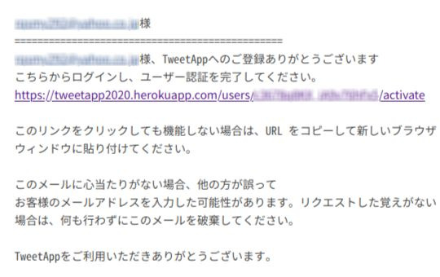
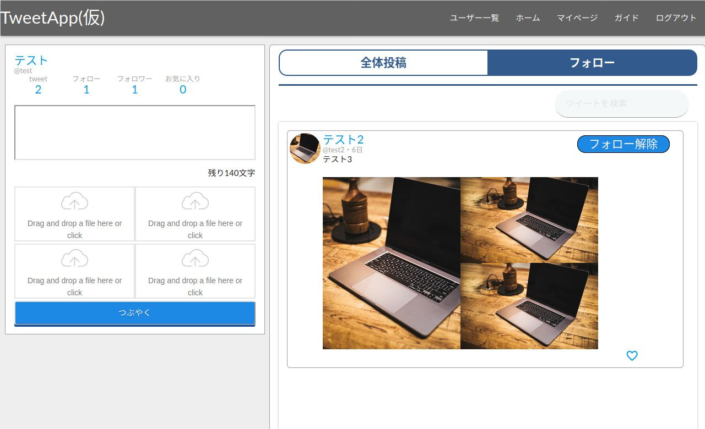
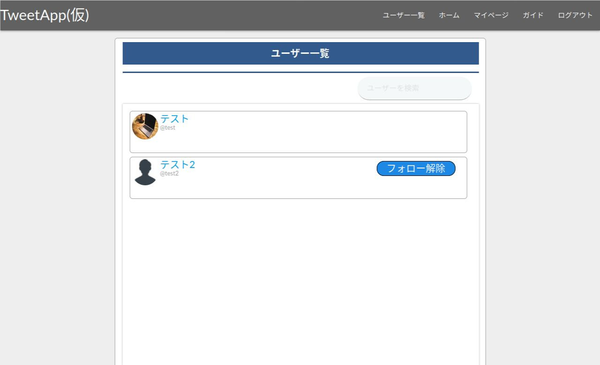

# TweetApp

# 概要
 
TweetAppはポートフォリオに記載するために作製した会員登録製の無料SNSサービスです。
現在ユーザーフォローや文章、画像投稿機能、投稿のお気に入り登録が利用できます。
 
# 機能紹介
 
* ユーザー登録、編集、詳細表示、削除
* ユーザー認証
* パスワードリセット
* ログイン、ログアウト、ログイン状態保持
* 文章、画像投稿、削除
* ユーザーフォロー、フォロー解除
* 投稿お気に入り登録、解除
* 検索機能

## ポイント

* gemやプラグインを利用した複数画像投稿、ドラッグ＆ドロップ機能
* gemを利用した検索機能
* タブ切り替えにより同一ページ内で情報の切り替えが容易
* cookieを用いたタブの状態の保存

# 動作環境

* Firefox
* GoogleChrome
* MicrosoftEdge

各ブラウザ最新バージョンでの動作を確認しています。  
現在Internet Explorerではログイン状態の保存のチェックボックスが機能しません。  
他のブラウザでの動作は保証いたしかねます。
 
# ご利用方法

## ユーザー登録

下記のリンクより利用を開始できます。  

<https://tweetapp2020.herokuapp.com/>

各情報を入力し「登録する」をクリックすると「ユーザー認証メール」が送信されます。

## ログイン

メールが届いたことを確認し、記載されたURLからログインページに移動することで、ユーザー認証が完了します。  
ログインページではご登録時に入力した、「メールアドレス」と「パスワード」を入力することで本サービスをご利用することが出来ます。  
なお、「ユーザー認証メール」が届かない場合は"tweetapp.reply@gmail.com"からのメールを届くようにご設定のうえ、  
ログインページの下部の「ユーザー認証メールを再送信しますか？」より再度メールを受信して、認証を完了してください。

## ホーム

ログイン後、ホーム画面に移動します。  
ここでは、本サービスをご利用中のすべてのユーザーの「tweet」とフォロー中の「tweet」が確認できます。  
また、画面左側では「tweet」が行なえます。「tweet」には1~140文字の文章が必要で、画像を1~4枚追加できます。  
投稿フォーム上部のカウントからマイページの各コンテンツへ移動することも出来ます。  

## マイページ

マイページ(ユーザーページ)ではそのユーザーの「tweet」「フォロー」「フォロワー」「お気に入り」を確認できます。  
また、マイページでは上部の「プロフィール編集」からご自身の「ユーザー名」「ユーザーID」「プロフィール」を変更することが出来ます。  
「ユーザーアイコン」につきましては外部サービス[Gravatar](https://ja.gravatar.com/)により「メールアドレス」に紐付けられた画像が表示されるようになっています。  
アイコン変更の際には上記のリンクよりお願いします。

## ユーザー一覧

ユーザー一覧では本サービスをご利用中のすべてのユーザーを確認することが出来ます。

## ユーザー情報

ユーザー一覧やユーザーページで表示されるユーザー情報は左上から  
「ユーザーアイコン」「ユーザー名」「ユーザーID」「フォローボタン/フォロー解除ボタン」「プロフィール」となります。  
「フォローボタン/フォロー解除ボタン」でユーザーの「フォロー/フォロー解除」が行えます。  
「フォロー」中のユーザーはマイページの「フォロー」に表示され、その投稿はホームの「フォロー」に表示されます。  
また「フォロー」したユーザーは「フォロー」されたユーザーの「フォロワー」に追加されます。
これらは「フォロー解除」を行うことですべて解除されます。
なお、ご自身(ログイン中のユーザー)のユーザー情報には「フォローボタン」は表示されません。

## tweet

ホームやユーザーページで表示される「tweet」は右下のハートマークで「お気に入り」に登録、ゴミ箱のマークで「削除」することが出来ます。  
「お気に入り」に登録した「tweet」はマイページの「お気に入り」から確認でき、もう一度クリックした場合「お気に入り」から解除出来ます。  
「tweet」の削除は「tweet」の投稿者のみ行うことができ、削除前に確認が表示されますが、削除してしまうと復元は出来かねますのでご注意ください。 

## 検索機能

ホームやユーザーページなどで検索機能を利用することで、「ユーザー」や「tweet」の絞り込みが行なえます。

## その他

* パスワードをお忘れの場合はログインページ下部の「パスワードをお忘れですか」より「パスワードリセットメール」を送信し、  
受信したメールに記載されているURLより手続きをすすめることで「パスワード」を変更することが出来ます。  
* サービスご利用中にご不明な点がございましたら、ヘッダー内の「ガイド」よりサービスについての説明を確認することが可能です。  
それでもご不明な点が解消されない場合や、不具合があった場合は「ガイド」内の「お問い合わせ」よりご連絡ください。  
* 本サービスにご登録中の情報の削除(退会)は「ログイン」状態で「ガイド」の「退会」から行うことが出来ます。  
一度「退会」を完了させてしまうと情報の復元は出来かねますので「退会」に記載されている内容をご確認の上手続きをお願いします。

 
# アップデート
 
今後のアップデートでは  

* 不具合の修正
* フレキシブルデザインの採用を含めたUIの更新
* 「tweet」へのメッセージ機能の追加
* 「動画投稿」機能の追加

を予定しています。

# 製作環境

## OS

* Linux(Ubuntu 18.04)

## 言語

* Ruby 2.6.3
* HTML5(slim)
* Sass

## フレームワーク

* Ruby on Rails 5.2.4.3
* materialize-sass 1.0.0

## データベース

* SQLite3 1.4.2(開発環境)
* postgreSQL(本番環境)

## バージョン管理

* Git(Bitbucket)

## 環境

* AWS cloud9(開発環境)
* Heroku(本番環境)

# 製作者情報
 
* 氏名: 外山大貴
* E-mail: rqsmy2922@gmail.com

# ライセンス
 
"TweetApp" is under [MIT license](https://en.wikipedia.org/wiki/MIT_License).
 